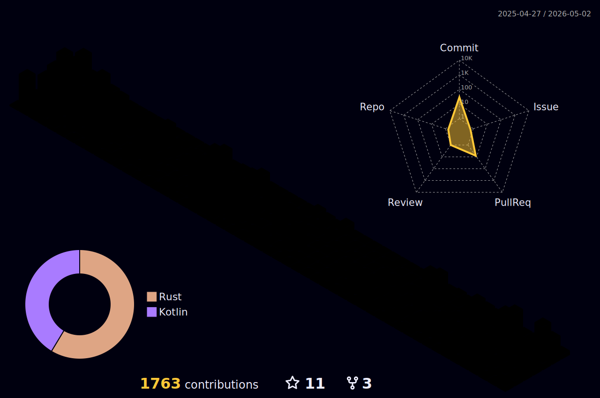

### Hello
Code enthusiast by heart, especially interested in low-level programming languages. 

<!-- 
 -->

<!--

**niclaslind/niclaslind** is a ✨ _special_ ✨ repository because its `README.md` (this file) appears on your GitHub profile.

Here are some ideas to get you started:

- 👯 I’m looking to collaborate on ...
- 🤔 I’m looking for help with ...
- 📫 How to reach me: ...
- 😄 Pronouns: ...
- ⚡ Fun fact: ...
-->
